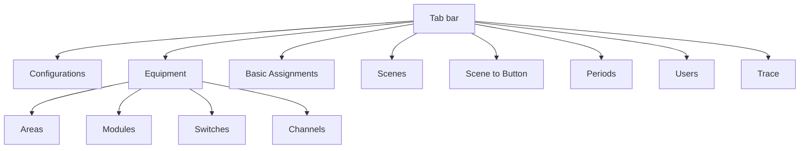
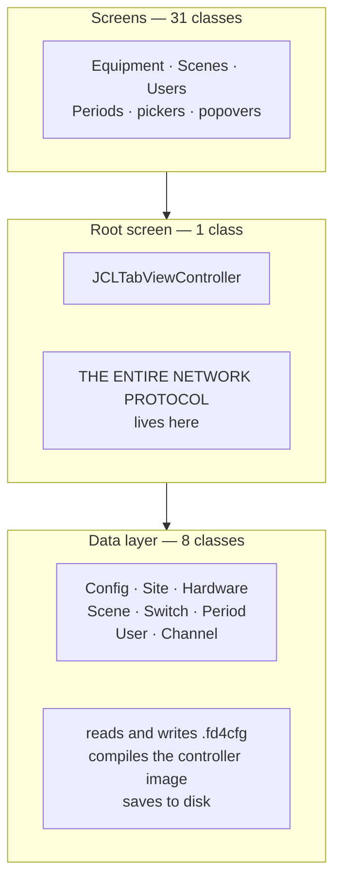
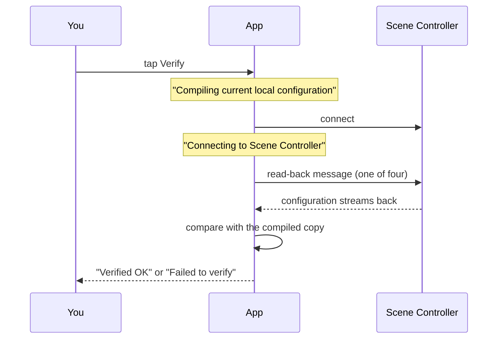
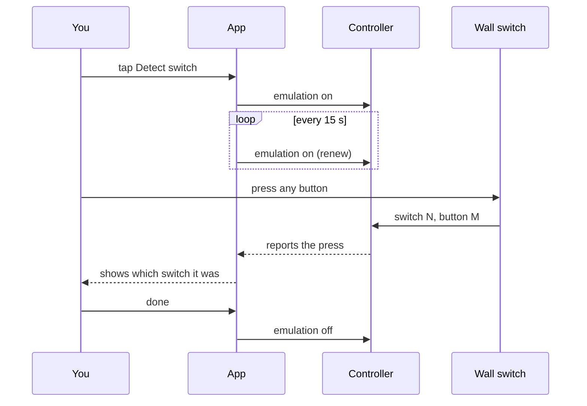
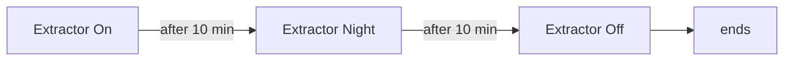
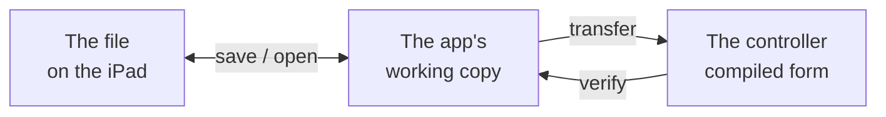

# The FlexiDim Configuration App

**A complete description of the iOS FlexiDim app: what every screen does, what
happens when you touch it, and what it does behind your back.**

Companion to [`FLEXIDIM-SYSTEM.md`](./FLEXIDIM-SYSTEM.md), which describes the
lighting system itself. That document explains *what the system is*; this one
explains *what the app does to it*. Where they overlap they agree — the system
document is the authority on wire formats and file layout, and this one links to
it rather than restating.

Everything here comes from reverse-engineering **iOS FlexiDim 2.97** (arm64) and
from watching a real Scene Controller. Nothing comes from the web
reimplementation.

### Confidence markers

| Marker | Meaning |
| --- | --- |
| **[HW]** | Observed against a real Scene Controller |
| **[BIN]** | Read directly out of the app's compiled code |
| **[INF]** | Inferred from strong evidence, not directly read |
| **[?]** | Not known — stated so you don't assume otherwise |

---

## Contents

1. [What the app is for](#part-1--what-the-app-is-for)
2. [The shape of the app](#part-2--the-shape-of-the-app)
3. [How the app is built](#part-2b--how-the-app-is-built)
4. [Ideas that apply everywhere](#part-3--ideas-that-apply-everywhere)
4. [The screens](#part-4--the-screens)
5. [When the app talks to the controller](#part-5--when-the-app-talks-to-the-controller)
6. [Where your work is stored](#part-6--where-your-work-is-stored)
7. [What we still do not know](#part-7--what-we-still-do-not-know)

---

## Part 1 — What the app is for

The app does three jobs.

**Describe the building.** Which rooms exist, which lights are in them, which
dimmer module drives each light, where the switches are. This is data entry, and
most of it happens once at commissioning.

**Decide what things do.** Which lights a switch controls. What "Evening" means.
What happens at sunset. This is the creative part and gets revisited for years.

**Push it to the controller, and check it took.** The building doesn't change
until you transfer.

It also does a fourth thing that isn't obvious from the screens: **it is a
diagnostic tool.** It can flash a light to identify it, make a switch report its
own presses, and search for an unlabelled channel.

> **The app is not required for the building to work.** The Scene Controller runs
> on its own. Close the app, turn off the iPad, the lights still work. The app is
> for changing things and finding faults.

---

## Part 2 — The shape of the app

Nine tabs. Every one is a **list on the left, detail on the right** — pick
something on the left, edit it on the right. **[BIN]**

Roughly in the order you'd use them when commissioning:

| Tab | What you do there |
| --- | --- |
| **Configurations** | Pick a site, pick a configuration, set the address and security code, transfer to the controller |
| **Equipment** | Describe the building: areas, modules, channels, switches |
| **Basic Assignments** | Say which lights each switch controls directly |
| **Scenes** | Build named lighting states and the rules around them |
| **Scene to Button** | Put scenes on switch buttons |
| **Periods** | Define time windows scenes can depend on |
| **Users** | People, their codes, and which areas they may control |
| **Trace** | Watch the raw conversation with the controller |

### Screens behind the tabs

The app has **32 screens** in total **[BIN]**. Most are popovers reached from a
main screen — a picker, a folder browser, a colour wheel.

---

## Part 2b — How the app is built

### What ships in the app

An iOS app is a folder. This one holds **356 files**:

| Count | What | Purpose |
| --- | --- | --- |
| **1** | `FlexiDim` | The executable. **All code is in here** |
| **82** | scene layouts inside the storyboard | One per screen — the visual layout |
| **3** | loose layouts | Reusable table rows |
| **171** | images | Room icons, switch plates, buttons |
| **3** | `.DST` files | Daylight-saving rules, as **data** not code |
| **2** | sounds | Including a beep for channel search |
| **3** | settings files | App metadata |
| 1 | asset archive | Packed images |

Two things worth noting. The **daylight-saving rules are data files**, so they can
be corrected without changing the app. And the **beep is a real audio file**,
used when channel search finds something — a detail that only makes sense if the
installer is up a ladder away from the iPad.

### Is the UI separate from the rest?

**Partly — and not where you would hope.**

Source files do not survive compilation. There are **zero** source paths in the
executable, so the original file layout cannot be recovered. What *can* be
recovered is the **class** structure, which is what the source files would have
mirrored.

By class, the app splits three ways:

**The data layer is properly separated.** Eight classes hold the model and own
the file format, the compile step and saving. No screen writes a file itself.

**The network layer is not separated at all.** Every message to the Scene
Controller is sent by **`JCLTabViewController` — the tab bar screen**. **[BIN]**
It owns:

| What it owns | Examples |
| --- | --- |
| Sending commands | dim a light, press a switch |
| The transfer sequence | start and process a download |
| The verify sequence | start and process a verify |
| Message construction | checksums, encryption |
| Diagnostics | switch emulation, channel search, status requests |

So **there is no backend module.** The protocol is embedded in the root view
controller — the screen that draws the tab bar. A screen that needs to talk to
the controller calls up into its parent tab controller.

| Layer | Classes | Separated? |
| --- | --- | --- |
| Screens | 31 | Yes, one per screen |
| Screen layout | 82 files | Yes, outside the code |
| Data model, file format, compile | 8 | **Yes** |
| Network protocol | 0 — inside a screen class | **No** |

> **What this means for reimplementation:** the file format and the compile step
> can be lifted cleanly, because they live in their own classes with clear
> boundaries. The protocol cannot — it must be reconstructed from a single large
> UI class where networking, timers and screen state are intertwined.

### Class sizes, as a guide to where the work is

The biggest classes tell you where the app's complexity actually sits **[BIN]**:

| Methods | Class | What it is |
| --- | --- | --- |
| 221 | Scenes detail | The scene editor — by far the most complex screen |
| 154 | Channel detail | One light, with live control and diagnostics |
| 135 | Site details | The site form |
| **131** | **Config** | **The data model, file format and compiler** |
| 109 | Users detail | |
| 105 | Controller pane | Transfer and verify UI |
| **105** | **Tab controller** | **The entire network protocol** |

---

## Part 3 — Ideas that apply everywhere

Learn these five and every screen makes sense.

### 1. Two locks, not one

Nothing is editable until you turn on **Allow changes**. Hardware has a *second*
lock on top, released by a code. **[BIN]**

Why the split: renaming a scene is harmless. Changing module order silently
re-addresses every light after it (see the system document,
[Addressing](./FLEXIDIM-SYSTEM.md#addressing-how-a-light-gets-a-number)). The
second lock exists to make you stop and think.

### 2. Nothing you type reaches the building

Editing changes the app's copy. The lights change when you **transfer**. Two
separate acts, easily confused:

| Action | Changes the file | Changes the building |
| --- | --- | --- |
| Editing | after you save | no |
| Saving | yes | no |
| Transferring | no | yes |

### 3. Except when it does — live preview

Some controls send *immediately* so you can see the effect. Dragging a brightness
slider dims the real light as you drag. **[BIN]** These are previews: they change
what the light is doing *now*, not what the configuration says.

### 4. Deleting doesn't delete

Deleted things go to a **Deleted items** folder. **[BIN]** Because the
configuration is a web of references — delete a room and its channels point at
nothing — the app keeps them recoverable.

### 5. Changed things are marked

Edit a channel and it's flagged as changed. Edit modules and the site is flagged.
**[BIN]** The app tracks what hasn't been sent yet.

---

## Part 4 — The screens

Each screen below: what it's for, what you can change, what that changes
underneath, and what it sends.

---

### Configurations

Two panes: **Site details** and **Controller**. **[BIN]**

#### Site details

Where the building lives and how to reach it.

| Control | Effect |
| --- | --- |
| Site name, four address lines, contact, phone, email | Bookkeeping. Not sent to the controller |
| **Site ID** | Identity. **Its fifth character decides the connection type** **[BIN]** |
| **Security code** (16 characters) | Required to connect. Wrong code, no session |
| IP address / **Auto detect** | Fixed address, or search the network |
| Latitude, longitude | Used to calculate sunrise and sunset |
| Time zone, **DST rule** | Local time and seasonal changes |
| Wireless gateways (4 addresses + counts) | For wireless accessories |
| Remote server, router port | Remote access |

> **The site type is derived, not chosen.** The app reads it from the Site ID's
> fifth character. Change the ID and the connection type changes with it. **[BIN]**

#### Controller

Where transfer and verification live.

| Control | What it does |
| --- | --- |
| **Download config** | Sends the configuration, then **the controller reboots** — lights may change or go off **[BIN]** |
| **Verify** | Reads the controller back and compares. Answers `Verified OK` or `Failed to verify` **[BIN]** |
| **Local CRC** | A checksum of the compiled configuration **[BIN]** |
| Last update | When it last changed |
| Equipment warning | Warns that equipment changed since the last transfer |
| **Enable hardware changes** | The second lock |
| Email | Sends the configuration file out |

> **Transferring reboots the controller.** The app warns that *"the lighting
> system will also reset which... may result in light levels changing or going
> off."* This happens whether the transfer succeeds or fails, so a transfer is
> never a no-op. Do not transfer while the building is occupied and expecting
> stable light. **[BIN]**

**Verify, step by step [BIN]:**

The app **cannot tell you what differed** — only whether it matched. **[BIN]**

**Nothing large is transferred.** The whole exchange is seven small messages out
and short replies back; the configuration itself does not travel in either
direction. **[BIN]** How the controller and the app therefore manage to compare
anything is **not yet known [?]** — see the system document,
[Reading the configuration back](./FLEXIDIM-SYSTEM.md#reading-the-configuration-back).

---

### Equipment

Four kinds of thing, all reached from one list.

#### Areas

Rooms and floors. Name, short name, an icon, and which area it sits inside.
Areas nest.

#### Modules

The dimmer boxes. **The riskiest screen in the app.**

| Control | Effect |
| --- | --- |
| Module ID | Which physical box |
| **Bus A / Bus B** | Which wiring run **[BIN]** |
| **Order** | Position in the list |
| On/off | Whether it's in service |
| Channel names | Jump to the channels it drives |
| **Send pending profiles** | Push module settings to the controller **[?]** |
| Email CSV | Export an equipment schedule |

> **Order is not cosmetic.** A channel's address is its module's *position* times
> eight, plus the channel number. Reorder modules and every light after the moved
> one gets a new address. **[HW]** This is why hardware sits behind its own lock.

#### Channels

One light. The most detailed screen in the app — 190 methods. **[BIN]**

| Control | Effect |
| --- | --- |
| Name, short name | Display |
| Module and channel number | Which output drives it |
| **Output type** | On/off, dimmable, leading edge, DALI, DMX, accessory… |
| Accessory type | For accessory outputs: `1-10V` or `Blind control` |
| Min / max / max permissible | Limits. An LED driver may not run below 10% |
| Default level | Where it goes when switched on |
| **Brightness slider** | **Sends live** — dims the real light as you drag **[BIN]** |
| **Flash** | Blinks the light so you can spot it **[BIN]** |
| **Channel search** | Steps through channels to find an unlabelled one **[BIN]** shape only |
| **Blind open / close / stop** | Blind motor control **[?]** |
| **Send channel profile** | Pushes this channel's settings **[?]** |

#### Switches

A wall plate.

| Control | Effect |
| --- | --- |
| Name, number | Identity |
| **Switch type** | 2-channel, 8-channel, 4-scene, 8-scene, or *Not used* **[BIN]** |
| Switch picture | Shows the plate you picked |
| **Detect switch** | Controller reports the next press, so you can identify a plate **[BIN]** |
| **Detect switch type** | Asks what kind of plate it is **[?]** |
| **Button flash** | Flashes a button's indicator **[?]** |

**How "detect by press" works [BIN]:** the app puts the controller into
*emulation mode*, which makes it report presses back. It must be renewed every
**15 seconds** or it lapses.

---

### Basic Assignments

Which lights a switch controls directly, without any scene.

| Control | Effect |
| --- | --- |
| **Add channels** | Pick lights for this switch |
| Select all / deselect all | Bulk pick |
| **Order channels** | **Order matters** — it's the order the controller processes them |
| Per channel: assign on / off / dimming / channel dimming | What the switch does to that light |
| On fade / off fade | How long the change takes |
| **On/off priority** | One setting for the whole switch **[BIN]** |
| **Auto fill** | Fills assignments across all switches at once **[BIN]** |

> **One priority setting per switch, not per light.** The file has exactly one
> such field per switch. **[BIN]** What it does is **[?]**.

---

### Scenes

The largest screen in the app — 272 methods. **[BIN]**

Scenes live in folders. A scene sets some channels to some levels, with rules
about when it may run and what happens next.

#### Per channel

| Control | Effect |
| --- | --- |
| **Brightness** | The level in this scene. **Sends live** when preview is on **[BIN]** |
| Fade time | How long to get there |
| Delay | Wait before starting this channel |
| Relative % | Adjust from current level rather than setting absolutely |
| 100% time | Special handling at full brightness |
| **Colour wheel** | Colour for DMX/DALI fittings **[BIN]** |

#### Rules

| Control | Effect |
| --- | --- |
| **Previous scene** | Only run if the last scene was this one |
| **Period 1 / Period 2** | Only run during these time windows |
| **State flag** | Set, clear, or require a remembered marker |
| **Auto start** | Run without being triggered |
| **Next scene** + mode + time + day | What runs afterwards |
| **Extender scene** + run first | A second scene alongside |

#### Chaining

Rules let scenes form sequences: run, wait, run the next.

#### Utilities

Generate whole sets of scenes at once **[BIN]**:

- **Simple Scenes** — one per room that has a switch, using that switch's channels
- **Extractor Sequence** — nine chained scenes for a timed fan
- **Security Sequence** — an eight-step occupancy simulation

Afterwards it offers to put the new scenes on buttons 1, 2 and 3 where free.

---

### Scene to Button

Assign scenes to switch buttons.

| Control | Effect |
| --- | --- |
| Switch picture with buttons | Pick a button |
| **Scene 1 / Scene 2** | First press and second press |
| Button rings | Shows which buttons are used |
| **Send modes** | Pushes button settings **[?]** |

> **A button can hold two scenes** — one for the first press, one for the second.
> The plate reports a different code for the shifted press. **[BIN]**

---

### Periods

Ten named time windows, followed by 25 State Flag names in a 5×5 grid.

| Control | Effect |
| --- | --- |
| Period name | Activates the row; clearing it also clears From/To |
| **From** — mode and time | Clock time, or sunrise/sunset with an offset |
| **To** — mode and time | Same |
| State flag name | Activates a remembered marker that Scenes can set, clear, or test |

Sunrise and sunset come from the site's latitude and longitude.
From/To remain disabled until the Period has a name.

---

### Users

| Control | Effect |
| --- | --- |
| Name | Display |
| **Security code** | Their personal code |
| **Area access** | Which areas they may control |
| Version, profile data | Bookkeeping for transfers |

---

### Trace

A live log of the conversation with the controller — every message in and out.
The screen you use when something isn't working.

---

## Part 5 — When the app talks to the controller

Most of the app never talks to the controller at all. Here's everything that does.

| Trigger | Sends | Timing |
| --- | --- | --- |
| Open a site with auto-detect | Discovery broadcast | On connect **[HW]** |
| Connect | 23-byte login | Once **[BIN]** |
| — | *(nothing)* | Controller streams levels unprompted **[HW]** |
| Drag a brightness slider | Set channel level | **Continuously while dragging** **[BIN]** |
| Tap Flash | Set channel level, twice | Immediately, on a timer **[BIN]** |
| Tap Verify | Read-back messages | Four-state conversation **[BIN]** |
| Tap Download config | Transfer sequence | **[?]** |
| Tap Detect switch | Emulation on | Then every 15 s **[BIN]** |
| Tap Channel search | Search messages plus ticks | On a timer **[BIN]** shape only |
| Tap Send profile | Profile messages | **[?]** |

### The controller talks first

Once connected, the controller streams **channel level reports** unprompted —
about one every 160 ms, cycling all **128** possible addresses, ~20.5 seconds for
a full pass. **[HW]**

> **It reports all 128 addresses whether or not anything is wired to them.** A
> reported address does not mean a light exists there. Anything that treats the
> reported set as "the channels that exist" is wrong.

Over 50 seconds of listening, nothing but level reports arrived. **[HW]**

### The connection is exclusive

**One control connection at a time.** The app must be closed before anything else
connects. **[HW]**

---

## Part 6 — Where your work is stored

### On the iPad

Configurations are written as **files** in the app's own documents area, named
after the site with a `.fd4cfg` extension. **[BIN]** No database.

Saving happens through one routine, called from **138 places** in the app **[BIN]**
— so saving is frequent and automatic, not a button you must remember.

### The file

An Apple archive of the whole configuration. Format and field layout are in the
system document, [The file format](./FLEXIDIM-SYSTEM.md#part-5--the-file-format-fd4cfg).

### On the controller

**A different form entirely.** The controller stores a *compiled* configuration —
numbered channels, levels and rules, with the names and folders stripped out.

This is why Verify says *"Compiling current local configuration"* before it starts:
the app cannot compare its file to the controller directly, so it compiles its copy
into the same shape first. **[BIN]**

#### The app owns the compile step

The **app** turns the configuration into controller bytes. The controller never
does — it receives a finished block and stores it. **[BIN]**

The compile routine runs from exactly **two** places in the app **[BIN]**:

| When | Why |
| --- | --- |
| You tap **Verify** | Compile our copy, read the controller back, compare |
| You tap **Download config** | Compile, then send |

Nothing else compiles. Editing doesn't, saving doesn't, and neither does opening
a file.

> **Two different "save to bytes" operations exist and are easy to confuse.**
> Saving or emailing a configuration writes a `.fd4cfg` file. Transferring builds
> a *completely different* block of bytes. They share no code, and the file is
> never what the controller receives. Full comparison in the system document,
> [Two encoders](./FLEXIDIM-SYSTEM.md#two-encoders-no-shared-code).

> The file and the controller are **not** the same information. A controller
> cannot tell you its room names — they were never sent. Full explanation in the
> system document,
> [Two representations](./FLEXIDIM-SYSTEM.md#part-4--two-representations).

### Three copies, and how they drift

| You did this | File | App | Controller |
| --- | --- | --- | --- |
| Edited something | stale | **new** | stale |
| Saved | **new** | new | stale |
| Transferred | new | new | **new** |
| Edited on another iPad | conflict | — | — |

The app detects the last case on import: same Site ID, different content. It
compares timestamps and offers *"Use imported (newer) site data"*. **[BIN]**

---

## Part 7 — What we still do not know

| Unknown | Consequence |
| --- | --- |
| **How Download config works** | We cannot transfer a configuration |
| **How the read-back replies are shaped** | We know the four messages; not the answers |
| **How a configuration is compiled** | Without it, no transfer and no real comparison |
| **The Local CRC calculation** | Cannot reproduce the number the app shows |
| **Blind control** | No dedicated message exists; it must ride another |
| **Channel search arguments** | Message shape known, contents not |
| **Send profile messages** | Module, channel and user profile transfers |
| **Detect switch type** | Distinct from detect-by-press; not traced |
| **Send modes** on Scene to Button | Not traced |
| **Four scene toggles** | `noExtender`, `extenderSceneBC`, `noLink`, `autoFill` — bit positions unknown |
| **Which output-type list a module offers** | Four lists exist; the choice rule is unknown |

### The one that unlocks the rest

**Reading the controller back writes nothing**, so it is safe to attempt. It
yields the controller's real stored configuration — the ground truth needed to
work out compilation, which in turn unlocks transfer, real verification, and the
checksum.

---

## Appendix — Screen reference

| Screen | Purpose |
| --- | --- |
| `ConfigMaster` / `ConfigDetail` | Site and configuration list and detail |
| `ConfigDetailSi` | Site details pane |
| `ConfigDetailCo` | Controller pane — transfer, verify, CRC |
| `EquipMaster` / `EquipDetail` | Equipment list and detail |
| `EquipDetailAr` | Area |
| `EquipDetailMo` | Module |
| `EquipDetailCh` | Channel |
| `EquipDetailSw` / `EquipDetailSwL` | Switch, switch list |
| `BSAMaster` / `BSADetail` | Basic Assignments |
| `ScenesMaster` / `ScenesDetail` | Scenes |
| `ScenesDetailBl` | Blind settings in a scene |
| `ScenePopoverCW` | Colour wheel |
| `ScenePopoverRules` | Scene rules |
| `ScenesPopoverPer` | Period picker |
| `S2BMaster` / `S2BDetail` | Scene to Button |
| `PeriodViewController` | Period editor |
| `UsersMaster` / `UsersDetail` | Users |
| `TraceViewController` | Message log |
| `EnableHWC` | Hardware unlock prompt |
| `PopoverTV` / `PopoverEquipTV` | Folder and equipment pickers |
