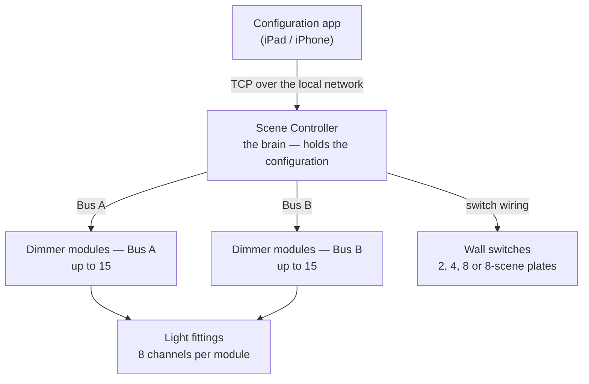
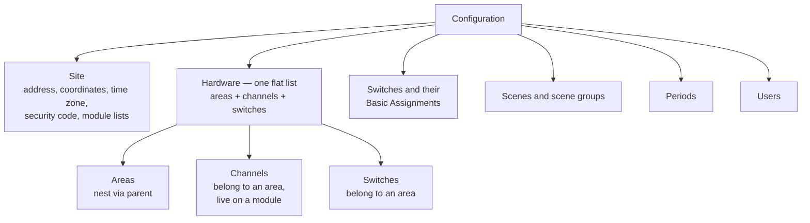
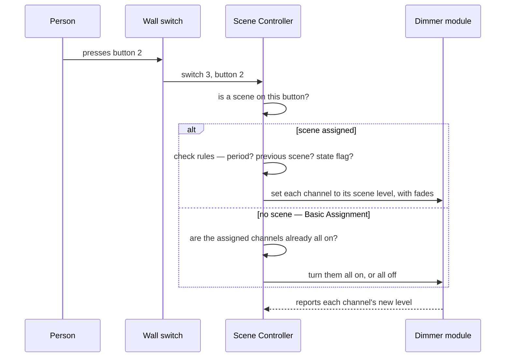
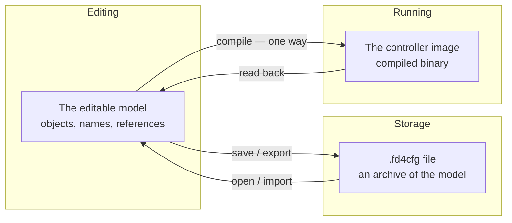
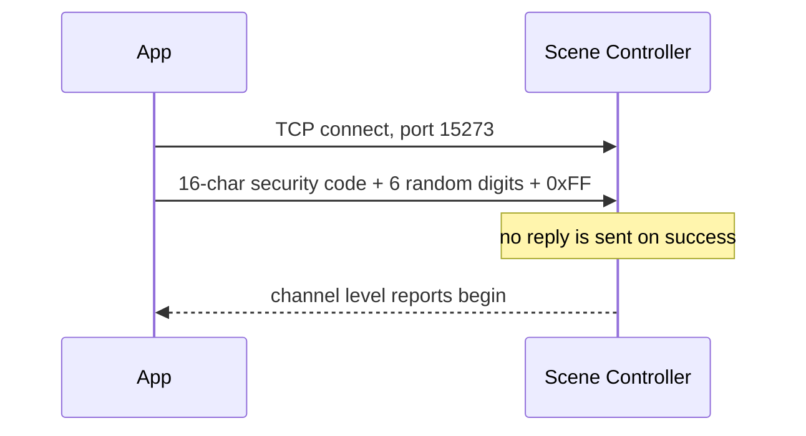
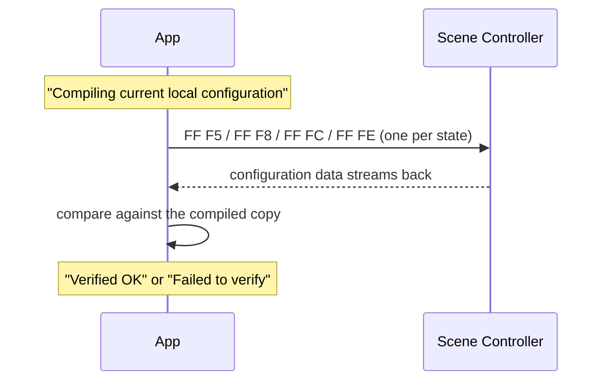
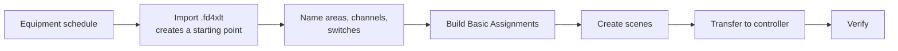
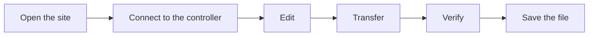

# The FlexiDim Lighting System

**A complete description of how a JCL FlexiDim installation works, from the light
fittings up to the configuration app.**

Everything here is derived from reverse-engineering the **iOS "FlexiDim"
configuration app, version 2.97** (arm64 slice), plus traffic observed from a real
Scene Controller. Nothing in this document is derived from the web application or
its bridge service — those are a reimplementation, and using them as a source
would just be quoting our own guesses back at ourselves.

Read it top to bottom: it starts with what the boxes on the wall are, and ends
with individual bytes.

### How to read the confidence markers

Every factual claim carries one of these:

| Marker | Meaning |
| --- | --- |
| **[HW]** | Observed on a real Scene Controller |
| **[BIN]** | Read directly out of the iOS app's compiled code |
| **[INF]** | Inferred from strong evidence, but not directly read |
| **[?]** | Not known. Stated so you don't assume we know it |

If something you need isn't here, it's probably marked **[?]** in
[Part 9](#part-9--what-we-still-do-not-know).

---

## Contents

1. [The physical system](#part-1--the-physical-system)
2. [Terminology](#part-2--terminology)
3. [The configuration: what it actually contains](#part-3--the-configuration)
4. [The two representations, and why they differ](#part-4--two-representations)
5. [The configuration file format](#part-5--the-file-format-fd4cfg)
6. [Talking to the Scene Controller](#part-6--talking-to-the-scene-controller)
7. [The message catalogue](#part-7--the-message-catalogue)
8. [Workflows](#part-8--workflows)
9. [What we still do not know](#part-9--what-we-still-do-not-know)

---

## Part 1 — The physical system

A FlexiDim installation is four kinds of thing.



**Light fittings** are ordinary loads — lamps, LED drivers, blind motors. They have
no intelligence and no address of their own.

**Dimmer modules** are the boxes that actually switch and dim power. Each module
drives **8 channels**, and one channel drives one light or group of lights wired
together. A module knows nothing about scenes or rooms; it responds to "set
channel 3 to 40%".

**The Scene Controller** is the brain. It holds the entire configuration, runs the
scenes, watches the clock for time-based events, and listens to the wall switches.
**It keeps working with no app connected and no network** — the app is a
configuration and diagnostic tool, not part of normal operation.

**Wall switches** are physical plates. Pressing a button tells the Scene
Controller which switch and which button; the controller decides what that means.
The switch itself has no idea what it controls.

### The single most important idea

> The Scene Controller is the source of truth for the running building.
> The app holds a *copy* of the configuration, which may or may not match.

Every confusing part of this system comes from that gap. The app can edit its
copy freely; the building doesn't change until the configuration is transferred.

---

## Part 2 — Terminology

The app's own vocabulary, because its screens and file format use these words.

| Term | What it means |
| --- | --- |
| **Site** | One building or installation. Has an address, coordinates, a time zone, and a security code. One Scene Controller per site |
| **Configuration** | A complete, named set of everything: rooms, lights, switches, scenes, timers, users. A site can hold several; one is active |
| **Area** (or Room) | A place. Areas nest — a Floor contains Rooms. Purely organisational |
| **Channel** | One controllable output. "Kitchen spots" is a channel. Belongs to an area, lives on a module |
| **Module** | A physical dimmer box with 8 channels |
| **Bus** | A wiring run from the controller to modules. There are two, A and B |
| **Switch** | A physical wall plate |
| **Button** | One press-point on a plate. Buttons can be *shifted* — a second press does something different |
| **Basic Assignment** | Which channels a switch controls directly, and how. The "this switch turns on these lights" mapping |
| **Scene** | A named set of channel levels, with fade times and rules. "Evening" sets six channels to specific brightnesses |
| **Scene group** | A folder of scenes. Groups nest |
| **Period** | A named time window — "Evenings", "Weekday mornings". Starts and ends at a clock time, or at sunrise/sunset with an offset |
| **State flag** | A remembered on/off marker the controller keeps, so scenes can depend on what happened earlier |
| **Extender** | A second scene run alongside the first |
| **Next scene** | A scene that runs automatically after this one, after a delay or at a time |
| **User** | A person with a security code and a list of areas they may control |

### Names for the same thing

The app's internal names differ from its screens, and both appear in this document.

| On screen | In the code **[BIN]** | In the file |
| --- | --- | --- |
| Configuration | `JCLFDConfig` | the whole document |
| Site | `JCLFDSite` | slots `$1`–`$29` |
| Area, Channel, Switch | `JCLFDHardware` | one flat list |
| Basic Assignment entry | `JCLFDChannel` | `bs0`…`bsN` |
| Switch | `JCLFDSwitch` | the `bsa` list |
| Scene / group | `JCLFDScene` | the scenes list |
| Period | `JCLFDPeriod` | the periods list |
| User | `JCLFDUser` | the users list |

**A surprise worth flagging:** areas, channels and switches are all the *same
class*, `JCLFDHardware`, in one flat list. What distinguishes them is a `type`
field and a parent reference. There is no separate "rooms table". **[BIN]**

---

## Part 3 — The configuration

### The shape of it



### Hierarchy is by reference, not nesting

Areas nest by each one naming its parent, and the lists are flat. A channel points
at its area; a scene points at its group; a group points at its parent group.
**[BIN]**

This matters: **deleting anything can orphan something else.** Delete a room and
its channels point at nothing. The app has a "Deleted items" area precisely
because deletion is dangerous.

### What a channel knows

| Field | Meaning |
| --- | --- |
| Name, short name | Display |
| Area | Which room it's in |
| Module + channel index | Which physical output drives it |
| Output type | On/off, dimmable, leading edge, DALI, DMX, accessory… |
| Minimum / maximum | Limits — an LED driver may not go below 10% |
| Maximum permissible | A hard ceiling above the normal maximum |
| Default level | Where it goes when switched on with no level given |
| Dimmable | Whether it can dim at all |
| Accessory type | For accessory outputs: `1-10V` or `Blind control` |
| Changed | Whether it's been edited since the last transfer |

### What a scene knows

A scene is more than a set of levels. **[BIN]**

| Field | Meaning |
| --- | --- |
| Name, short name | Display |
| Group | Which folder |
| Channel settings | Per channel: brightness, fade time, delay, relative-%, 100%-time |
| Next scene + mode + time + day | What runs afterwards, and when |
| Previous scene | Only run if the last scene was a particular one |
| Extender scene + run-first | A second scene to run alongside |
| Period 1, Period 2 | Only run during these time windows |
| State flag | Set, clear, or require a remembered marker |
| Flags | Auto-start and other toggles |
| Type, locked, display rank | Behaviour and presentation |

**Scenes chain.** A scene can trigger another after a delay, which can trigger
another. That's how the app builds an extractor-fan sequence or a holiday
occupancy simulation out of ordinary scenes.

### How a button press becomes light



Two distinct mechanisms: **Basic Assignment** (this switch controls these lights,
plain on/off/dim) and **Scene to Button** (this button runs this scene). A button
can do either. **[BIN]**

### Addressing: how a light gets a number

The controller doesn't know names. It addresses channels by number. **[HW]**

```
channel address = (module's position in the list × 8) + channel index
```

The **position in the list** matters, not the module's ID number. Three modules
`7000`, `7010`, `7020` give addresses 1–8, 9–16 and 17–24. **[HW]**

> **Reordering modules silently re-addresses every light after the one you
> moved.** The addresses are positional, so inserting a module shifts everything
> below it.

Bus B numbers from **16** onward, so each bus holds at most 15 modules. **[BIN]**

---

## Part 4 — Two representations

**This is the part that causes the most confusion, so it gets its own section.**

The configuration exists in two completely different forms.



| | The editable model / file | The controller image |
| --- | --- | --- |
| Contains | Names, groups, notes, display order, deleted items | Only what's needed to run the building |
| Structure | Objects referring to each other by key | A flat block of raw bytes with a header |
| Produced by | The app's editor | The app's compile step **[BIN]** |
| Reversible? | Yes — file and model are the same information | **No** — compiling discards things |

### The evidence for this

This was originally asserted on thin grounds, so it was re-checked directly in the
app's compile routine. **[BIN]**

- The routine is **8,937 instructions** long — far too large to be a simple copy.
- It **writes raw bytes**: 234 individual byte-store instructions, into a buffer
  with a fixed header at byte offsets `0x12`–`0x17`.
- The header carries a **three-byte length** at offsets `0x18`–`0x1A`, read back
  and combined to size the block.
- It then runs a **checksum over that buffer** for exactly that length.
- Before writing bytes it **renumbers and re-sorts** the model: it assigns fresh
  index values, sorts lists into a fixed order, and resolves each reference
  through the module lookup.
- It reads scene rules, basic assignments and hardware, but it never touches
  names, folders, icons or display order beyond using them to establish order.

So the controller image is a genuine binary block with its own header, length and
checksum — built *from* the model, not a copy *of* it. The file and the image are
different artefacts.

### Two encoders, no shared code

The app contains **two separate routines** that turn the model into bytes, and
they have nothing in common. **[BIN]**

| | Makes the file | Makes the controller image |
| --- | --- | --- |
| Routine | the export routine | the compile routine |
| Output | `.fd4cfg` — an Apple object archive | a raw block: header, body, length, checksum |
| Keeps names and folders | Yes | **No** — never reads them for output |
| Reversible | Yes — reading it restores the model | **No** |
| Sent to the controller | Never | Always |

```
                    ┌── export ──►  .fd4cfg file      (save, share, re-open)
  the model in the ─┤
  app's memory      └── compile ─►  controller image  (transfer — one way)
```

> A `.fd4cfg` on disk is **not** what the controller holds, and one cannot be
> turned into the other without going through the app's model.

### Who compiles, and when

**The app compiles. The controller never does.** It receives a finished block and
stores it. **[BIN]**

The compile routine is called from exactly **two** places **[BIN]**:

| Called from | Why |
| --- | --- |
| The verify sequence | Compile our copy, read the controller back, compare like with like |
| The transfer sequence | Compile, then send the bytes |

That is the whole reason verify shows *"Compiling current local configuration"*
before it does anything else.

### Are the file and the controller 1:1?

**No.** They are not the same information, and the difference is not cosmetic.

The file holds everything a *person* needs: room names, scene names, folder
structure, display ordering, contact details, deleted items kept for recovery. The
controller holds only what a *machine* needs to run lights: numbered channels,
levels, times, rules.

The app makes this explicit — before comparing against the controller it shows
**"Compiling current local configuration"** **[BIN]**, because it cannot compare
the file to the controller directly. It must first compile its copy into the same
form the controller holds, then compare like with like.

> **Consequences you will actually hit:**
> - A controller cannot tell you its room names. They were never sent.
> - Two different files can compile to identical controller images — rename a
>   scene and the building behaves identically.
> - Losing the file is serious. Reading the controller back does not give you
>   back your names and folders.
> - "Does the controller match my configuration?" can only ever mean "does it
>   match the *compiled form* of my configuration?"

---

## Part 5 — The file format (`.fd4cfg`)

### What kind of file it is

A binary file in a **standard Apple format** for saving objects to disk. **[BIN]**
Not a JCL invention, and not human-readable text. Any tool that can read Apple
object files can open it.

### The unusual part: positional keys

That Apple format normally saves each value with a **label**, so a reader can ask
for "the site name". FlexiDim doesn't use labels. It writes values one after
another, and Apple's code numbers them `$0`, `$1`, `$2`… in the order they were
written. **[BIN]**

> **This means the file has no field names. Meaning comes entirely from
> position.** Insert one value in the wrong place and every following field is
> misread — silently, because everything still parses.

### Layout, in order

| Position | Contents |
| --- | --- |
| `$0` | The literal text `"29"` — a format-version marker |
| `$1`–`$29` | Site fields (below) |
| `modc` | How many Bus A modules |
| next *modc* slots | Bus A module IDs |
| `modcB` | How many Bus B modules |
| next *modcB* slots | Bus B module IDs (only written for two-bus sites) |
| `hwc` | How many hardware objects |
| next *hwc* slots | Areas, channels and switches, one flat run |
| then | Configuration name, description, an 8-character code, a timestamp |
| then | Count, then that many **switches** |
| then | Count, then that many **scenes** |
| then | Count, then that many **periods** |
| then | Count, then that many **users** |

Each list is preceded by its length written as a *decimal string* — `"11"`, not
the number 11. **[BIN]**

### The site fields

| Slot | Field | Slot | Field |
| --- | --- | --- | --- |
| `$1` | Site name | `$15` | Longitude |
| `$2`–`$5` | Address, four lines | `$16` | Latitude |
| `$6` | Contact name | `$17` | Time zone |
| `$7` | Phone | `$18` | Router inbound enabled |
| `$8` | Email | `$19` | Router inbound port |
| `$9` | Site ID | `$20` | Daylight-saving rule |
| `$10` | Security code (16 chars) | `$21`–`$24` | Wireless gateway addresses |
| `$11` | IP address | `$25`–`$28` | Wireless gateway counts |
| `$12` | Auto-detect IP | `$29` | Remote server |
| `$13` | Modules changed | | |
| `$14` | Last updated | | |

**The site type is not stored.** The app derives it from the **fifth character of
the Site ID**. **[BIN]** Type 0 is a plain local connection; other types are
remote and encrypted.

### Object fields

Two-letter keys. **[BIN]**

**Hardware** — `ky` key · `nm` name · `sn` short name · `ra` display rank ·
`hw` output type code · `ix` index · `md` module · `mi`/`mx` min/max ·
`mp` max permissible · `df` default · `di` dimmable · `ch` changed · `ac` accessory type

**Scene** — `ky` key · `pr` parent · `gr` is-a-group · `nm`/`sn` names ·
`ns`/`nsm`/`nt`/`nd` next scene, mode, time, day · `es` extender · `re1` run extender first ·
`ps` previous scene · `p1`/`p2` periods · `sf` state flag · `fl` flags ·
`rm` icon · `dr` display rank · `lk` locked · `ty` type · `cc` channel count · `ch0…` channels

**Switch** — `ky` key · `op` on/off priority · `bs0…` basic assignment channels ·
`bu0…` scenes on buttons

**User** — `ky` key · `nm` name · `sk` security code · `rc` area count ·
`rm0…` area grants · `ve` version

### The other file type: `.fd4xlt`

A plain **text** file, CRLF lines, pipe-separated, with three sections:
`#SWITCHES`, `#CHANNELS`, `#SWITCH-SCENES`. **[BIN]**

It is **not** a backup. Importing one creates a *new starting-point*
configuration — empty scenes, empty users, a fresh "Deleted items" folder — for
commissioning a new site from an equipment schedule. One-way. **[BIN]**

---

## Part 6 — Talking to the Scene Controller

### Finding it

The app broadcasts on the local network; the controller answers with its address.
**[HW]** A site can also store a fixed address instead.

### Opening a session



Login is a single **23-byte** record: the site's 16-character security code, six
random digits, and a `0xFF` terminator. **[BIN]** There is no acknowledgement —
you know it worked because level reports start arriving. **[HW]**

> **Only one control connection at a time.** The iPad app must be closed before
> anything else connects.

### The controller talks first, and constantly

Once a session is open the controller streams **channel level reports** without
being asked — roughly one every 160 ms, cycling through **all 128 possible channel
addresses**, taking about 20.5 seconds for a full pass. **[HW]**

> **It reports all 128 addresses whether or not anything is wired to them.** A
> reported address does not mean a light exists there.

Over 50 seconds of listening on a real controller, **nothing but level reports
arrived** — no other record type is volunteered. **[HW]**

### Frame shapes

Messages to the controller come in five shapes. **[BIN]**

| Prefix | Used for |
| --- | --- |
| `FF F3` | Commands — dim a light, press a switch, search for a channel |
| `FF F1` | Status requests — period flags, pending scenes |
| `FF FC` | Configuration read-back and user data |
| `FF FE`, `FF F5`, `FF F8` | Configuration read-back conversation |
| `FF FD` / `FF FE` | Switch emulation on/off |
| `F4` (no `FF`) | Channel-search tick |

Every message ends with a **CRC-16/X25** checksum, low byte first. **[HW]**

### Two escaping problems, and how they're solved

`0xFF` marks the start of a message, so no byte *inside* a message may be `0xFF`
or the reader would think a new message had begun. Two different tricks avoid
this. **[BIN]**

1. **Escaping** — a marker byte `0x1B` is inserted before any awkward value
   (`0x1B` itself, or `0xFD` to `0xFF`). The reader sees the marker and knows the
   next byte is data, not a new message.
2. **Trimming to seven bits** — some commands cut each value down to seven bits so
   it can never reach the reserved range, and record the bits they removed as
   flags in an earlier byte. Nothing is lost; it is just carried separately.

### What comes back

Replies are **not** wrapped the same way as messages going out. They're short records ending in a
check byte that is the **low seven bits of the sum of the preceding bytes** — a
different, weaker check than the CRC used outbound. **[HW]**

| Record | Length | Meaning |
| --- | --- | --- |
| `F2 <address> <level> <check>` | 4 | A channel's current level. Addresses count from zero, so `F2 10` is channel 17 **[HW]** |
| `F4 …` | 5 | Command acknowledgement **[INF]** |
| `F5 …` | 5 | State notification **[INF]** |

---

## Part 7 — The message catalogue

Every message the app can send. This list is **complete**: it was produced by
finding every place in the app that builds a checksummed message. **[BIN]**

| Purpose | Shape | Status |
| --- | --- | --- |
| Set a channel's level | `FF F3 04 <ch> <level> <fade>` | **[HW]** |
| Press a switch button | `FF F3 00 <switch> <button> 00` | **[BIN]** |
| Scene / brightness step | `FF F3 06 …` 7-bit packed | **[BIN]** |
| Channel search — start / next / tick | `FF F3 05 …` and `F4 …` | **[BIN]** shape only |
| Ask for period flags | `FF F1 00 00 00 00 00 00 00` | **[BIN]** |
| Ask for pending scenes | `FF F1 01 00 00 00 00 00 00` | **[BIN]** |
| Switch emulation on / off | `FF FD …` / `FF FE …` | **[BIN]** |
| Send user data | `FF FC 00 00 00 00` | **[BIN]** |
| Read configuration back | `FF F5` / `FF F8` / `FF FC` / `FF FE` | **[BIN]** |
| Send configuration | download sequence | **[?]** |
| Module profiles, gateway list | — | **[?]** |

### Levels and times

- **Level** is a percentage, `0`–`100` (`0x00`–`0x64`) — not 0–255. **[HW]**
- **Fade time** is counted in **half-seconds**. A value of 4 means 2 seconds. **[HW]**

### Switch emulation

Sending `FF FD` puts the controller into a mode where it reports button presses
back to the app — that's how "identify a switch by pressing it" works. It lapses
unless renewed every **15 seconds**. **[BIN]**

### Reading the configuration back

The app's compare feature works like this **[BIN]**:



**The app cannot ask for a specific part.** All four messages are fixed
constants — no block number, no offset, no length. **[BIN]**

What is firmly established **[BIN]**:

- Starting a verify performs no network activity of its own; it hands straight to
  the reply handler.
- The whole exchange writes **seven small messages** and nothing else. **No bulk
  configuration data is sent in either direction.**
- The app compiles its own copy during the exchange.
- Replies are at least **10 bytes**. The **first reply byte must be 6**, or the
  app goes straight to failure.
- On success the remaining bytes are unpacked as a **time** and shown as
  `Verified OK   <name> HH:MM:SS`.

**How the comparison actually works is not yet known. [?]** Seven six-byte
messages out and a ten-byte reply in cannot by themselves compare a whole
configuration, so something must carry the basis for the comparison that we have
not found. Candidates — the controller retaining a checksum from the last
transfer, or a value exchanged elsewhere — are unverified. This document will not
guess.

The result is a single verdict: **`Verified OK`** or **`Failed to verify`**. The
app never says *what* differed. **[BIN]**

### The controller reboots after a transfer

A third message exists — **`Failed to verify - resetting`** — but it does **not**
belong to the verify feature. It belongs to the **transfer** sequence, which runs
its own verify step at the end. **[BIN]**

"Resetting" means exactly what it says: **the Scene Controller reboots.** It is
not a retry, and it is not an app-side operation. **[BIN]**

The app's own words:

> *"Download complete - resetting Scene Controller"*
> *"The lighting system will also reset which, depending on the new
> configuration, may result in light levels changing or going off."*
> *"The Scene Controller will reset automatically in a few minutes, if it is not
> already working normally."*

> **This is the most physically disruptive thing in the whole system.** A
> transfer reboots the controller, and the building's lights may change level or
> switch off while it happens. A *failed* transfer is not a no-op — the reset
> happens either way.

**Who triggers the reboot is not proven [INF].** There is no reset command
anywhere in the app, and no reset message in the complete message list. The app
has a "reset not detected" state, which implies it *watches* for the reboot
rather than causing it. The likely design is that the controller reboots itself
once it has a new configuration, and the app waits and confirms. The app's
mention of the controller resetting "automatically in a few minutes" suggests the
controller has its own watchdog for when this goes wrong.

---

## Part 8 — Workflows

### Commissioning a new site



### Editing an existing site



> **The file and the controller are updated separately.** Saving the file does not
> change the building; transferring to the controller does not save the file.
> Doing one and not the other is the most common way to lose work.

### Two safety locks

The app keeps hardware editing behind a **separate lock** from ordinary editing,
released by a code. **[BIN]** Renaming a scene is low-risk; changing module order
silently re-addresses every light after it.

### Scene creation utilities

The app can generate whole sets of scenes **[BIN]**:

- **Simple Scenes** — one per room that has a switch, using that switch's Basic Assignment channels
- **Extractor Sequence** — nine scenes chained to run a fan on a timer
- **Security Sequence** — an eight-step occupancy simulation with folders, control scenes and triggers

Afterwards it offers to put the new scenes on buttons 1, 2 and 3 where free.

---

## Part 9 — What we still do not know

Stated plainly so nobody assumes otherwise.

| Unknown | Why it matters |
| --- | --- |
| **How a configuration is compiled** into the controller's stored form | Without it we cannot transfer, and cannot meaningfully compare |
| **The exact bytes of the read-back conversation** | We know the four messages; we do not know the replies or how the four states sequence |
| **How a configuration is transferred** to the controller | The download sequence exists but is not decoded |
| **The checksum the app displays** | The app has its own checksum routine over the compiled form; we cannot reproduce it |
| **Four of the scene toggles** | `noExtender`, `extenderSceneBC`, `noLink`, `autoFill` — we know they exist, not which bits |
| **Which output-type list a module offers** | Four lists exist; how one is chosen is unknown |
| **Blind control** | No dedicated message exists. It must ride another command; which is unknown |
| **Channel search payload** | The message shape is known; the arguments are not |
| **Encrypted remote sessions** | Site types other than 0 use AES; keys and framing unknown |

### The one that unlocks the rest

**Reading the controller back** is the key. It requires no writing, so it is safe,
and it yields the controller's real stored configuration. With that in hand,
compiling can be developed and checked against ground truth instead of guessed at
— which in turn unlocks transfer, verification and the real checksum.

---

## Appendix — Quick reference

**Ports** — TCP 15273 for control · UDP for discovery

**Login** — 16-char security code + 6 random digits + `0xFF` = 23 bytes

**Outbound checksum** — CRC-16/X25, low byte first

**Inbound check** — low 7 bits of the sum of preceding bytes

**Escaping** — prefix `0x1B` before any `0x1B` or `0xFD`–`0xFF` in a body

**Channel address** — (module position × 8) + channel index; Bus B from 16

**Level** — 0–100 · **Fade** — half-seconds · **Scan** — 128 addresses, ~20.5 s

**Max modules** — 15 per bus · **Channels per module** — 8
